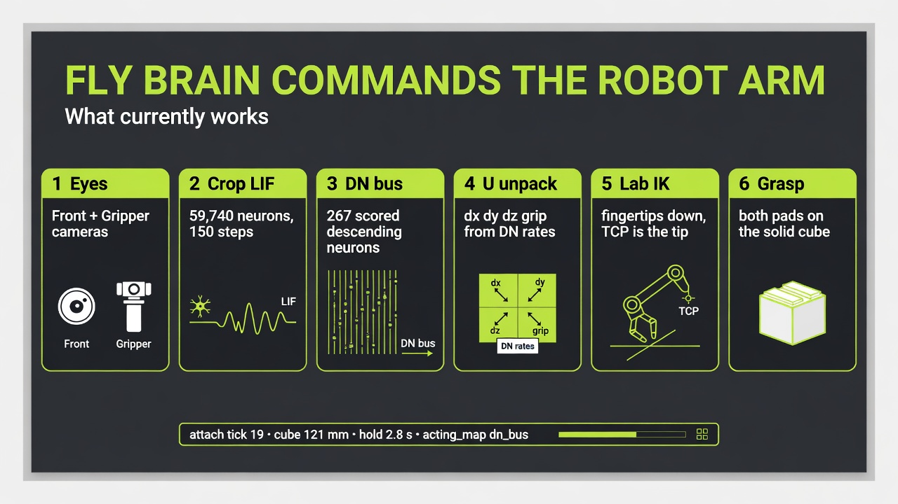
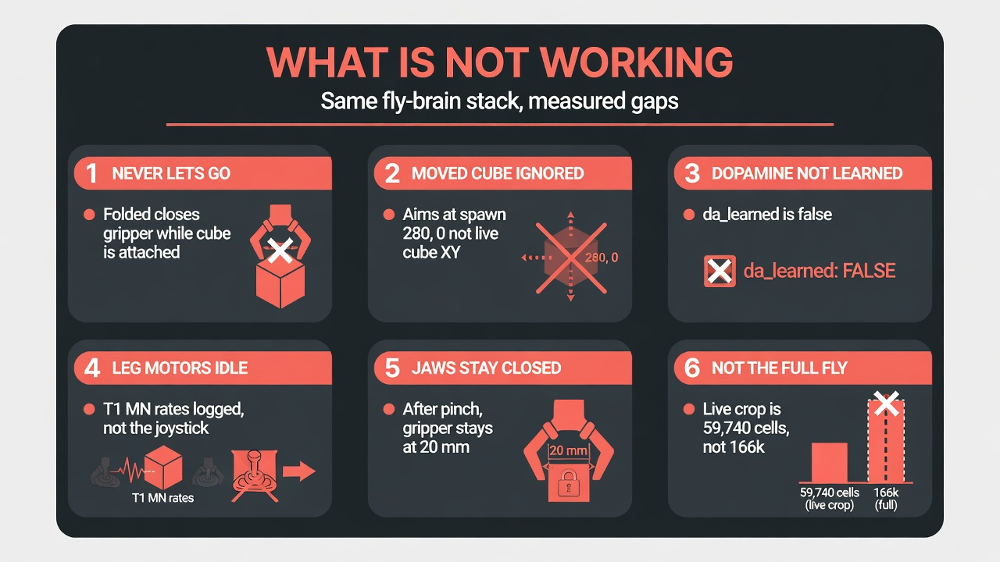

# fly-brain-grok

MaleCNS as an **external** controller for the [ReBot B601-DM](https://github.com/monomyth/rebot-motion-lab/tree/fly-brain-grok) kinematic arm. Pictures go into optical neurons. A scored descending-neuron bus commands tool-frame Δx/Δy/Δz and grip. The lab unpacks that with IK. There is no connectome code inside Swift.

| | |
|---|---|
| Code (this repo) | https://github.com/monomyth/fly-brain-grok |
| Distilled weights + optic crop | https://huggingface.co/monomyth/fly-brain-grok |
| Simulator branch | https://github.com/monomyth/rebot-motion-lab/tree/fly-brain-grok |




## What works

Last live 20 mm episode (`eval-size20`): `acting_map=dn_bus` on 37/37 ticks, first attach at tick 19 (gripper 20.9 mm), first +Z at tick 20, cube z 121 mm, `tcp_level`, hold 2.8 s. Attach is a pinch of the **solid** (corner or edge is enough). Overlay / k-NN / `|dz|` rewrite are not this path.

- Crop LIF: 59,740 neurons, 150 steps/tick, Front + Gripper JPEG (`apply:false`)
- Scored DN bus: DNfl, DNxl, DNa01, DNa02, DNp01 (abort), MDN, DNp07, DNp10
- After pinch, Δz comes from distilled `w_contact × scored DN Hz`, not a sign flip of the pre-grasp mix
- 20 mm table cube: fingertips down (TCP is still the fingertip). keep_level hits link5 on the floor below ~42 mm

## What does not work yet



- After a hold, cleanup Folds with the gripper shut, so the cube is **not released**
- Approach rails use spawn XY (default 280, 0), not a cube you drag in the UI
- `da_learned` is false (no KC→MBON freeze/shuffle that changed pick rate)
- T1 motor-neuron rates are logged, not the joystick
- Live plant is the optic crop, not all ~166k MaleCNS cells

## Run

Needs macOS 14+, the `fly-brain-grok` simulator branch, Python 3.11+, and MaleCNS downloads in `$MALECNS_HOME` (not this repo).

```sh
git clone https://github.com/monomyth/fly-brain-grok.git
cd fly-brain-grok
git clone -b fly-brain-grok https://github.com/monomyth/rebot-motion-lab.git rebot-motion-lab-grok

python3 -m venv controller/.venv
source controller/.venv/bin/activate
pip install -e controller huggingface_hub numpy scipy pillow pyarrow

export MALECNS_HOME="$HOME/data/malecns"          # GCS feathers + prepared graph
export FLYBRAIN_DATA="$PWD/data"

# weights (tiny) + optional optic crop (~19 MB)
huggingface-cli download monomyth/fly-brain-grok --local-dir "$FLYBRAIN_DATA/hf-fly-brain-grok"
cp "$FLYBRAIN_DATA/hf-fly-brain-grok/g-distill.npz" "$FLYBRAIN_DATA/checkpoints/rebot-pickup/"

# 1. Open the Grok lab (Dock icon). Do not use a different ReBot app.
bash rebot-motion-lab-grok/scripts/wrap-debug-app.sh
python controller/scripts/open_lab.py

# 2. Drive it from MaleCNS (app already open)
python controller/scripts/run_dn_bus.py --no-overlay --size 20 --ticks 120 --hold 2 \
  --tag eval-size20 --gains "$FLYBRAIN_DATA/checkpoints/rebot-pickup/g-distill.npz"
```

Connectome prepare (once, large): `python controller/scripts/prepare_graph.py` then crop via `controller/arm/crop.py`. The Hugging Face `*.npz` crop skips a lot of that if you only want to replay the distilled controller.

## Layout

| Path | Role |
|---|---|
| `controller/` | MaleCNS crop LIF, DN bus, U unpack, MCP client |
| `docs/preview/` | Infographics and pick stills |
| `docs/malecns-arm-control-plan.md` | Architecture |
| `data/checkpoints/rebot-pickup/` | Local eval JSON (weights on Hugging Face) |

Lab IPC name: `rebot-motionlab-grok-<uid>`. Capture uses `apply:false` so it does not steal the live camera.
